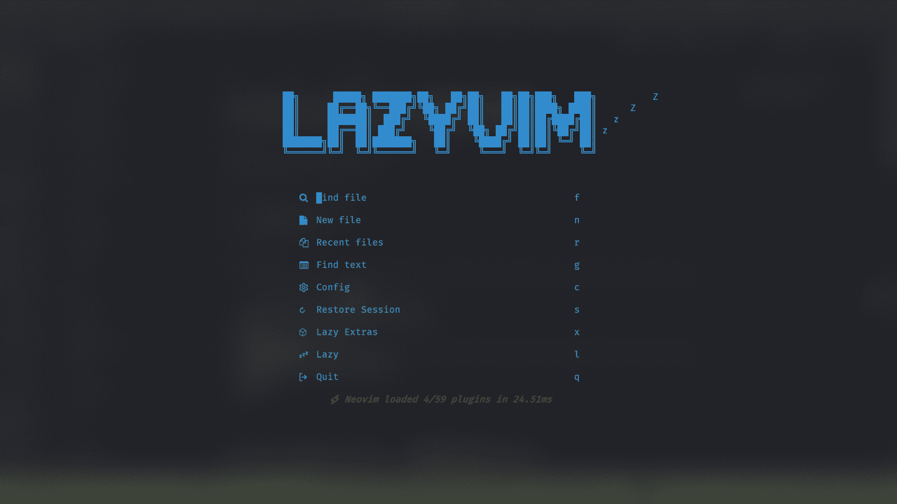
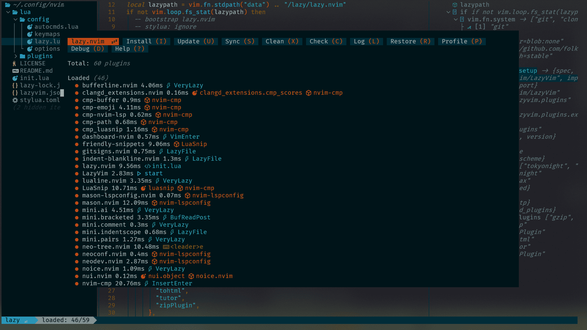
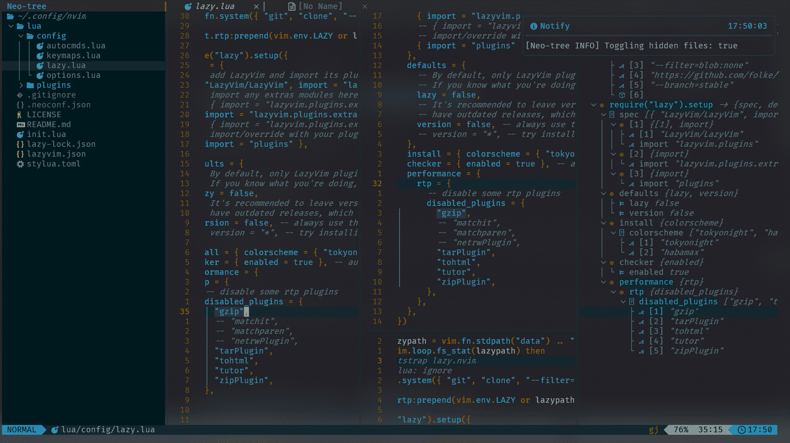

# 💤 LazyVim

A starter template for [LazyVim](https://github.com/LazyVim/LazyVim).
Refer to the [documentation](https://lazyvim.github.io/installation) to get started.







## Installation requirements for windows users

```shell
scoop install fd ripgrep fzf nodejs make cmake luarocks
```
