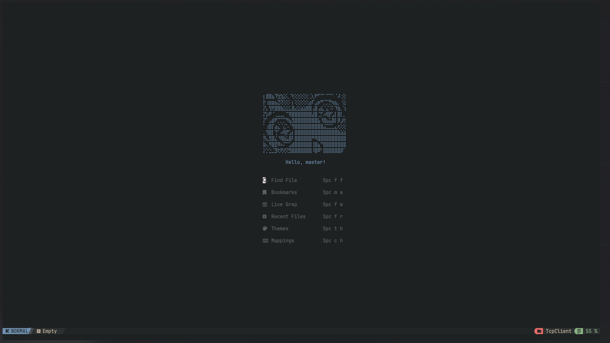
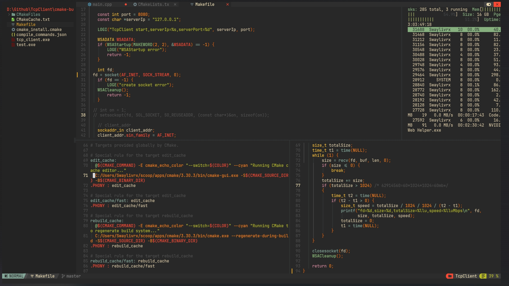
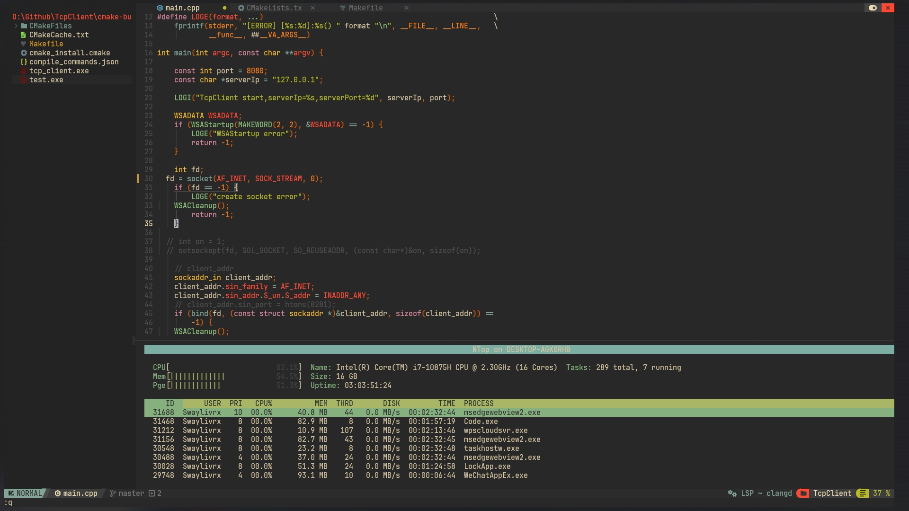
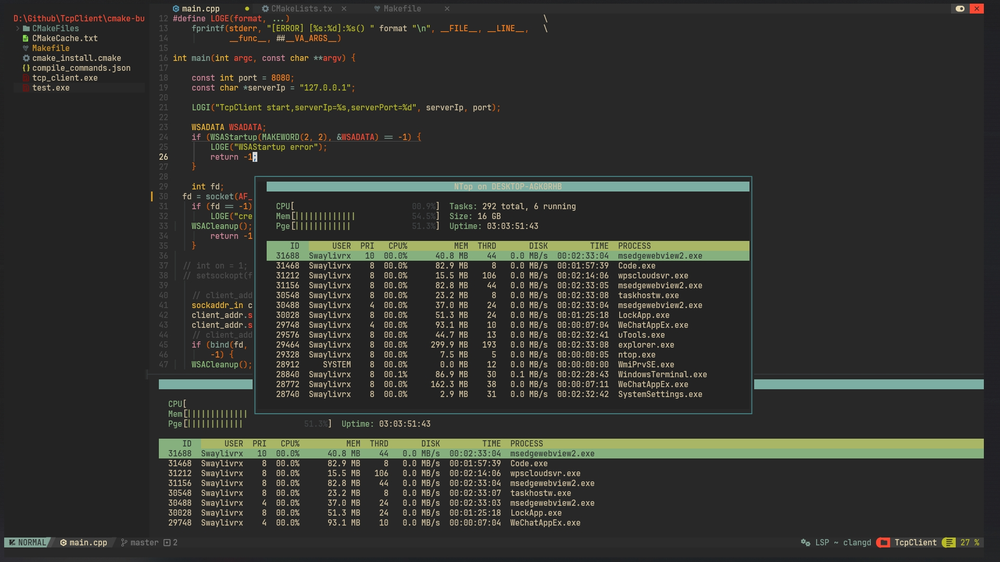

# 💤 nvchad

A starter template for nvchad.




## Startup
If you're using Command Prompt(CMD)
```shell
git clone https://github.com/NvChad/starter %USERPROFILE%\AppData\Local\nvim && nvim
```

If you're using PowerShell(pwsh)
```shell
git clone https://github.com/NvChad/starter $ENV:USERPROFILE\AppData\Local\nvim && nvim
```

## Requirements





- `Windows`

  ```shell
  scoop install fd ripgrep fzf nodejs make cmake luarocks
  ```

- `MacOS`

  ```shell
  brew install fd ripgrep fzf nodejs make cmake luarocks
  ```
